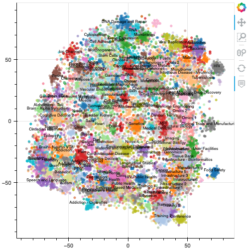

# NIH RePORTER

## Summary

I started this project with the goal of learning some NLP and applying it to looking at NIH Funding. The project trains gensim's implementation of word2vec on NIH grant abstracts and creates TF-IDF document vectors. 

With this dataset in hand, one can    
- test word2vec representation classics like king - man + woman = queen with multiple_sclerosis - human + mouse = ?. Or A grant document vector - method1 + method2 -> ?. 
- Find TF-IDF keywords for grants by looking at the nearest words to the grant's document vector
- Find nearest neighbor grants by looking at the nearest document vectors to a grant's document vector
- cluster grants into unsupervised list of topic categories
- create nice tSNE visualizations of NIH grant funding

**Sample output**   

`word_vectors.most_similar(positive=['multiple_sclerosis','skin'],negative=['brain'])`  

>```
    vulgaris
    vitiligo
    cutaneous
    atopic_dermatitis
    blister

`word_vectors.most_similar_cosmul(positive=['multiple_sclerosis','mouse'],negative=['human'])`  

>```
    experimental_autoimmune
    cuprizone
    eae
    encephalomyelitis_eae
    mog
```


## To do
Here are some ideas that I still want to implement: 
- Level of funding to each cluster  
- Representation of different institutions or locations within each cluster  
- Identify faculty that are most diverse across clusters vs most focused  
- Rates of patent activity per cluster  
- Identify grants that are "unusual" combination of topic vectors  
- Map startups press release vectors onto grant space.  

## Setup

### Data

The NIH provides lots of grant data to the public at the [NIH Exporter Website](https://exporter.nih.gov/ExPORTER_Catalog.aspx). 

For the years 2018-2020, I downloaded the projects and abstracts to the `data/raw` directory. There should be 6 files of the format:  
- projects: `RePORTER_PRJ_C_FY[YEAR]_new.csv`
- abstracts: `RePORTER_PRJABS_C_FY[YEAR]_new.csv`

### Environment

This project required the following libraries, which can be found in the environment.yml file.  

#### Utils
- jupyter=1.0.0=py38h50d1736_6
- pandas=1.2.4=py38h1f261ad_0

#### Plotting 
- bokeh=2.3.1=py38h50d1736_0
- selenium=3.141.0=py38h5406a74_1002 

#### NLP 
- spacy=3.0.6=py38he35c9cc_0
- gensim=4.0.1=py38ha048514_0
- pyemd=0.5.1=py38h6be0db6_1002

I found spacy a pain to install with `conda`. This is what worked for me.    
``conda config --set channel_priority false   
conda update --all --yes   
conda install -c conda-forge spacy
python -m spacy download en_core_web_sm
``  

#### ML and tSNE
- scikit-learn=0.24.2=py38h011f2c5_0

## Notebooks

`1. Build and Clean Dataset`

This notebook cleans up and consolidates the NIH grant datasets. 

**Inputs:**
 - ../data/raw/ should contain csv datasets downloaded from NIH project exporter   
**Outputs:** 
 - ../data/clean/NIH_grants.csv should be cleaned and consolidated dataset
 
 
**Steps:**
- For each abstract, convert all words to lowercase and remove alphanumeric characters
- Lemmatize all words using en_core_web_sm model from gensim
- Create bigram model and learn word pairs
- Output single dataframe with all grant information and cleaned, lemmatized, bigrammed grant abstracts
 
Bigram models will be saved to ../models/. 

`2. Build Word2Vec Model`

Trains the word2vec model and creates document vectors for each grant. 

**Inputs:**
- data/clean/NIH_grants.csv output by first notebook   

**Outputs:** 
- data/clean/corpus.pkl, the corpus of abstracts in list of list form for training
- models/w2v.pkl, the trained word2vec model
- models/word_vectors.pkl, the word vectors, much faster than importing the whole model
- models/grant_vectors.pkl, document vectors for each grant

**Steps:**
- Construct corpus from the NIH grant abstracts in list of list form
- Train word2vec model
- Compute grant document vectors

We compute the grant vectors by doing a weighted average of the word vectors in each grant by the Term Frequency Inverse Document Frequency. 

First, Compute the TFIDF in order to create weights for averaging to create grant vectors. 

More information on TFIDF here: https://rare-technologies.com/pivoted-document-length-normalisation/

`3. Model Exploration and Clusters`

We have the following datasets and models now. 
1. `nih_grants` is pandas DataFrame that contains all the NIH grant data. Notable columns are `PROJECT_TITLE`, `PROJECT_TERMS`, `ORG_NAME`, `PI_NAMEs`, `TOTAL_COST`, `ABSTRACT_TEXT`

2. `word_vectors` is a gensim.models KeyedVectors instance for words identified in the cleaned and lemmatized abstracts. The keys are words. The vectors are (300,) vectors output by word2vec. 

3. `grant_vectors` is a gensim.models KeyedVectors instance with vectors assigned to each grant. This is calculated by averaging the vectors for each word in a the corresponding abstract. Keys are the index column in `nih_grants` DataFrame.

This notebook  
- Does some of the basic word2vec explorations described above
- Uses spectral clustering to cluster grant vectors of 20,000 random grants
- Compute tSNE of 20,000 random grants

`4. Analysis of Clusters`

Basic exploration of the clusters. 


